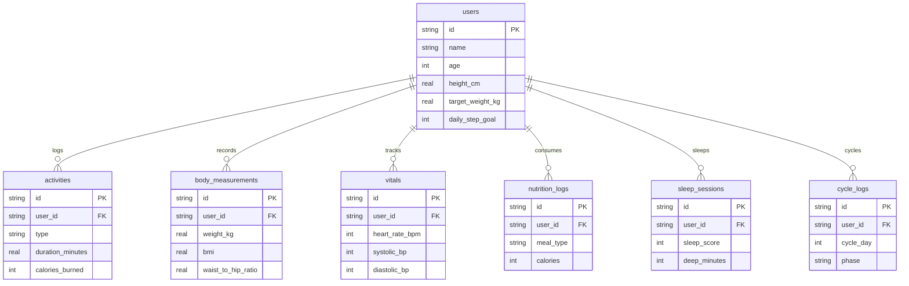
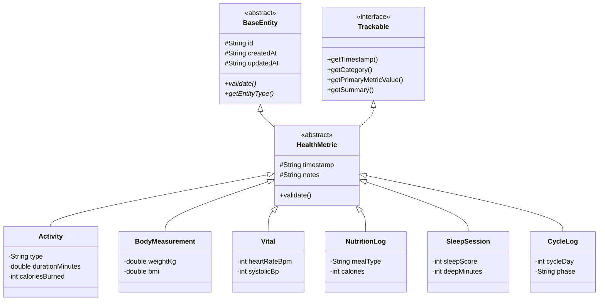

# ⚡ FITBIT 3D - Next-Gen Health & Biometric Suite

[](https://www.oracle.com/java/)
[](https://www.sqlite.org/)
[](web/index.html)
[](presentation/Review1_Presentation.html)

A modular, full-stack fitness and biometric tracker engineered on **Java 21**, featuring an interactive **3D WebGL Biometric Visualization Engine**, normalized **SQLite 3 Relational Database**, and full compliance with the **Java GUI Project Marking Rubric**.

---

## 🎯 Review 1 Marking Rubric Mapping

| Rubric Component | Marks | Project Implementation | Key Files |
|---|---|---|---|
| **OOP: Inheritance** | **10 Marks** (Combined) | Multi-level inheritance: `BaseEntity` (abstract) &rarr; `HealthMetric` (abstract) &rarr; `Activity`, `Vital`, `BodyMeasurement`, `NutritionLog`, `SleepSession`, `CycleLog` | [`BaseEntity.java`](file:///Users/mayank/Downloads/fitbit/src/fitbit/model/BaseEntity.java)<br>[`HealthMetric.java`](file:///Users/mayank/Downloads/fitbit/src/fitbit/model/HealthMetric.java) |
| **OOP: Polymorphism** | | Dynamic runtime method dispatch using `Trackable` interface, overridden `validate()`, `getSummary()`, `getPrimaryMetricValue()` | [`Trackable.java`](file:///Users/mayank/Downloads/fitbit/src/fitbit/model/Trackable.java)<br>[`Activity.java`](file:///Users/mayank/Downloads/fitbit/src/fitbit/model/Activity.java) |
| **OOP: Interfaces** | | Interface contracts for tracking metrics (`Trackable`) and generic persistence (`Repository<T, ID>`) | [`Trackable.java`](file:///Users/mayank/Downloads/fitbit/src/fitbit/model/Trackable.java)<br>[`Repository.java`](file:///Users/mayank/Downloads/fitbit/src/fitbit/repository/Repository.java) |
| **OOP: Exception Handling** | | Custom domain exception hierarchy: `FitnessException` (base) &rarr; `ValidationException`, `EntityNotFoundException`, `DatabaseException` with error codes | [`FitnessException.java`](file:///Users/mayank/Downloads/fitbit/src/fitbit/exception/FitnessException.java)<br>[`ValidationException.java`](file:///Users/mayank/Downloads/fitbit/src/fitbit/exception/ValidationException.java) |
| **Collections & Generics** | **6 Marks** | Type-safe Generic Repository `Repository<T extends BaseEntity, ID>`, `GenericRepository` with `ConcurrentHashMap`, `ArrayList`, Streams API, and Predicate filtering | [`Repository.java`](file:///Users/mayank/Downloads/fitbit/src/fitbit/repository/Repository.java)<br>[`GenericRepository.java`](file:///Users/mayank/Downloads/fitbit/src/fitbit/repository/GenericRepository.java) |
| **Database Design** | Core Req | 7 Normalized (3NF) relational tables with Foreign Keys, Check Constraints, and Performance Indexes in SQLite | [`schema.sql`](file:///Users/mayank/Downloads/fitbit/data/schema.sql)<br>[`fitbit.db`](file:///Users/mayank/Downloads/fitbit/data/fitbit.db) |
| **Database Connectivity** | Core Req | JDBC connection management using Singleton Pattern (`DbConnectionFactory`), `PreparedStatement`, and resource management | [`DbConnectionFactory.java`](file:///Users/mayank/Downloads/fitbit/src/fitbit/db/DbConnectionFactory.java)<br>[`DatabaseManager.java`](file:///Users/mayank/Downloads/fitbit/src/fitbit/db/DatabaseManager.java) |
| **UI/UX Aesthetics & Responsiveness** | Core Req | Responsive Cyber-Biometric Dark UI + 5 Interactive WebGL 3D Visualization Modes (Body Avatar, Heart, Rings, Orb, Disc) | [`index.html`](file:///Users/mayank/Downloads/fitbit/web/index.html)<br>[`engine3d.js`](file:///Users/mayank/Downloads/fitbit/web/js/engine3d.js) |

---

## 📊 Database Design (ER Diagram)

The SQLite database (`data/fitbit.db`) is structured according to Third Normal Form (3NF):



---

## 🏛️ OOP Class Hierarchy



---

## 🚀 How to Run the Project

### Option 1: One-Click Launch Script
```bash
cd /Users/mayank/Downloads/fitbit
./run.sh
```
* Compiles all Java files.
* Starts the web server on `http://localhost:8080`.
* Automatically launches your web browser.

### Option 2: Run Review 1 Verification Tests
```bash
java -ea -cp bin fitbit.test.TestRunner
```

---

## 📽️ Review 1 Presentation File Deliverables

You have two presentation formats prepared in the `presentation/` directory:

1. **Interactive HTML Slide Deck (`presentation/Review1_Presentation.html`):**
   - Open in any browser:
     ```bash
     open presentation/Review1_Presentation.html
     ```
   - Features keyboard arrow navigation (<kbd>&larr;</kbd> / <kbd>&rarr;</kbd>).
   - Click **"🖨️ Export PDF / Print"** (or press <kbd>Cmd</kbd> + <kbd>P</kbd>) to save as a submission-ready PDF file!
2. **Markdown Presentation Document (`presentation/Review1_Presentation.md`):**
   - Contains slide content, speaker script, bullet points, and diagram definitions.

---

## 🐙 How to Push to GitHub (For Review 1 Submission)

Run these commands in your terminal:

```bash
cd /Users/mayank/Downloads/fitbit

# 1. Add all files to git
git add .

# 2. Create the Review 1 commit
git commit -m "Complete Review 1: Project structure, Database design, JDBC connectivity, OOP architecture, and 3D UI"

# 3. Create a new public repository on GitHub (e.g. named fitbit-3d)
# Then link your repository and push:
git branch -M main
git remote add origin https://github.com/<YOUR_GITHUB_USERNAME>/fitbit-3d.git
git push -u origin main
```
