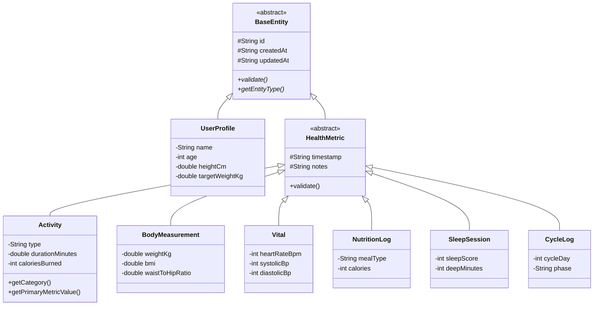
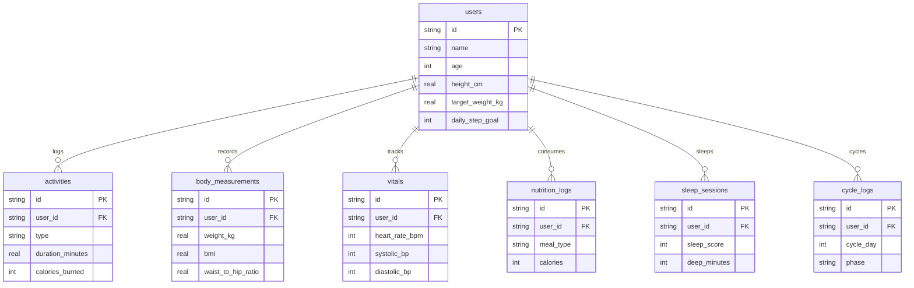

# ⚡ Review 1 Presentation: FITBIT 3D Health & Fitness Application

> **Project Title:** FITBIT 3D - Next-Generation Health & Biometric Tracking Platform  
> **Course / Review:** Java GUI Based Projects — Review 1 Evaluation  
> **Tech Stack:** Java 21 LTS, SQLite 3 / JDBC, WebGL 3D, Virtual Threads  

---

## 📑 Slide Deck Outline & Speaker Script

### Slide 1: Title & Introduction
* **Headline:** FITBIT 3D - Next-Generation Health & Biometric Tracking Platform
* **Presenter:** Student Project Team
* **Review Focus:** Project Structure, Database Design, Database Connectivity, OOP Architecture, Collections & Generics, and UI/UX Responsiveness.
* **Speaker Script:**  
  *"Good morning reviewers. Today, we present Review 1 of our project, Fitbit 3D. Our vision is to combine clinical-grade health tracking with immersive 3D WebGL biometrics, engineered cleanly on Java 21 with relational database persistence."*

---

### Slide 2: Project Scope & Core Modules
* **Domain Modules Covered:**
  1. **🏃 Activities:** Workouts (Running, Cycling, Strength, HIIT, Yoga) tracking duration, distance, calories, and HR zones.
  2. **📐 Body Measurements:** Weight, Height, Body Fat %, Muscle Mass, tape circumferences with BMI & Waist-to-Hip ratio calculation.
  3. **💓 Vitals:** Heart rate BPM, resting HR, blood pressure with AHA clinical classification, SpO2, blood glucose, and temperature.
  4. **🥗 Nutrition & Hydration:** Meals, macronutrients (protein, carbs, fat), and interactive water intake counter.
  5. **🛌 Sleep:** Sleep stages (Deep, Light, REM, Awake), efficiency %, 0–100 sleep recovery score, and Canvas hypnogram.
  6. **🌸 Menstrual & Cycle Tracking:** 4-phase cycle tracking, ovulation countdown, fertile window highlight, and symptoms.

---

### Slide 3: Modular Project Architecture
* **Directory Layout & Clean Layering:**
```
fitbit/
├── src/fitbit/
│   ├── model/         # Domain entities (BaseEntity, HealthMetric, Activity, etc.)
│   ├── repository/    # Generic Repository<T, ID> & DataStore
│   ├── db/            # DatabaseConfig, DbConnectionFactory, DatabaseManager
│   ├── exception/     # FitnessException, ValidationException, DatabaseException
│   ├── analytics/     # HealthCalculator, CyclePredictor
│   ├── controller/    # ApiHandler (REST endpoints)
│   ├── server/        # WebServer (Virtual Threads) & JsonUtil
│   └── Main.java      # Application Bootstrap
├── data/
│   ├── schema.sql     # Relational 3NF SQL DDL
│   └── fitbit.db      # SQLite Database
├── web/               # Responsive 3D WebGL UI
└── presentation/      # Review 1 Slide Deck & Docs
```

---

### Slide 4: OOP Implementation — Inheritance Hierarchy (10 Marks Rubric)

* **Key OOP Principles:**
  - Multi-level inheritance (`BaseEntity` &rarr; `HealthMetric` &rarr; `Activity`).
  - Code reusability for common fields (timestamps, IDs, notes).
  - Enforced validation template method across all subclasses.

---

### Slide 5: OOP Implementation — Polymorphism & Interfaces
* **Interface `Trackable`:**
  ```java
  public interface Trackable {
      String getTimestamp();
      String getCategory();
      double getPrimaryMetricValue();
      String getSummary();
  }
  ```
* **Dynamic Method Dispatch:**
  Subclasses override `getCategory()`, `getPrimaryMetricValue()`, and `getSummary()`. When iterating through a `List<Trackable>`, the JVM dispatches the appropriate specialized implementation at runtime.

---

### Slide 6: OOP Implementation — Exception Handling Hierarchy
* **Custom Exception Architecture:**
  - `FitnessException` (Root domain exception with error codes)
  - `ValidationException` (Subclass thrown when metric inputs violate clinical or realistic ranges)
  - `EntityNotFoundException` (Subclass thrown on missing database records)
  - `DatabaseException` (Subclass wrapping SQL and connection errors)
* **Pre-condition Validation:** Entities self-validate before state persistence using `validate()`.

---

### Slide 7: Collections & Generics (6 Marks Rubric)
* **Generic Repository Interface:**
  ```java
  public interface Repository<T extends BaseEntity, ID> {
      T save(T entity);
      Optional<T> findById(ID id);
      List<T> findAll();
      boolean deleteById(ID id);
      List<T> filter(Predicate<T> predicate);
      List<T> findSorted(Comparator<T> comparator);
  }
  ```
* **Collections Used:**
  - `ConcurrentHashMap<ID, T>` for thread-safe memory storage.
  - `ArrayList<T>` for dynamic list queries.
  - Java Stream API (`stream().filter(...).sorted(...).collect(...)`) for generic functional filtering.

---

### Slide 8: Database Design — Relational Schema (3NF)


---

### Slide 9: Database Connectivity (JDBC)
* **`DbConnectionFactory`:** Thread-safe Singleton factory establishing connections to SQLite (`jdbc:sqlite:data/fitbit.db`).
* **`DatabaseManager`:** Manages table integrity, queries schema metadata, and uses `PreparedStatement` to prevent SQL injection.
* **Dual-Persistence Mode:** Supports both SQL database operations and zero-dependency JSON serialization.

---

### Slide 10: UI/UX Design & 3D Interactive WebGL Engine
* **Interactive 3D Modes:**
  1. 🧍 **3D Anatomical Body Avatar:** Real-time morphing reflecting user weight/measurements with interactive click raycasting.
  2. ❤️ **3D Beating Heart:** Rhythmic systolic/diastolic contractions synced to the user's BPM.
  3. ⭕ **3D Activity Rings:** Glowing concentric rings for steps, calories, and duration.
  4. 🌙 **3D Sleep Orb:** Celestial geosphere displaying sleep architecture stages.
  5. 🌸 **3D Cycle Disc:** 28-day rotating lunar disc with fertile window indicator.
* **Aesthetics:** Cyber-biometric dark mode, glassmorphism, responsive across desktop and mobile.

---

### Slide 11: Review 1 Rubric Mapping
| Marking Rubric Criteria | Allocated Marks | Implementation in Project |
|---|---|---|
| **OOP: Inheritance** | Part of 10 | `BaseEntity` &rarr; `HealthMetric` &rarr; Concrete Logs |
| **OOP: Polymorphism** | Part of 10 | `Trackable` interface dispatch, overridden `validate()` & `getSummary()` |
| **OOP: Interfaces** | Part of 10 | `Trackable`, `Repository<T, ID>` |
| **OOP: Exception Handling** | Part of 10 | `FitnessException`, `ValidationException`, `DatabaseException` |
| **Collections & Generics** | **6 Marks** | `Repository<T, ID>`, `GenericRepository`, `ConcurrentHashMap`, Streams |
| **Database Design** | Core Req | 7 Normalized 3NF tables in SQLite with Foreign Keys & Indexes |
| **Database Connectivity** | Core Req | JDBC `DbConnectionFactory`, Singleton Pattern, `PreparedStatement` |
| **UI/UX Aesthetics & Responsiveness** | Core Req | Responsive Glassmorphism + 5 Interactive 3D WebGL scenes |
